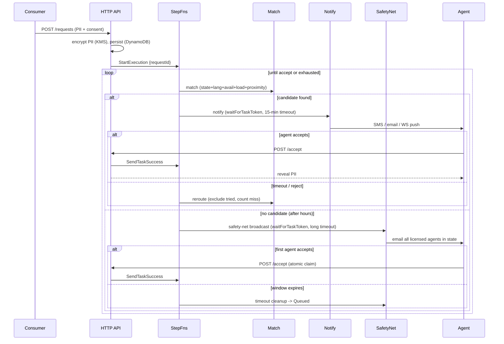
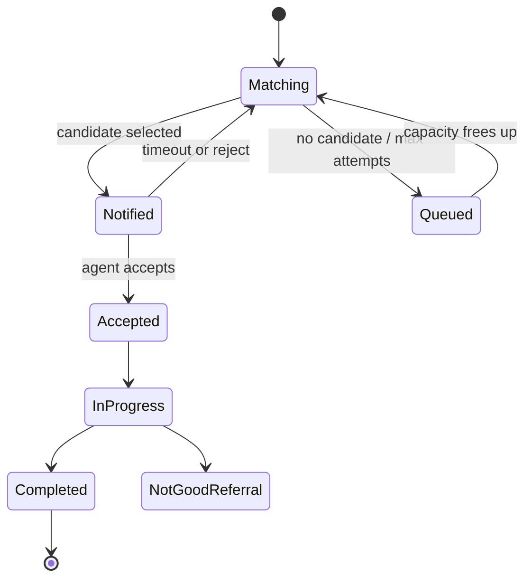

# RAN Architecture

## Components

| Layer | Technology | Responsibility |
|-------|-----------|----------------|
| Frontend | React + TypeScript (Vite) | Consumer intake, agent dashboard, admin dashboard |
| API (REST) | API Gateway HTTP API → Lambda | Request submission, agent actions, admin queries |
| API (real-time) | API Gateway WebSocket → Lambda | Live status to consumer/agent/admin |
| Compute | Lambda (Node/TS) | Stateless business logic |
| Orchestration | Step Functions | Per-request routing + 15-minute reroute timer |
| Data | DynamoDB | Agents, requests, connections, config |
| Security | KMS, Cognito | PII encryption, agent/admin identity & RBAC |
| Notifications | SNS, SES | SMS + email to agents/brokers |

## Request lifecycle

## After-Hours Consumer Safety Net

When no immediately-available agent is found (all offline / outside standard
hours / at capacity), the request falls through to the **SafetyNet** state:
`sfnSafetyNet` emails every licensed, participating, training-current agent in
the consumer's state (ignoring online status and hours). This is **email-only**
and carries **no penalty**, matching HOD policy. The first agent to accept wins
via an atomic DynamoDB conditional claim (`claimSafetyNetRequest`); other
acceptors get a 409 and cannot access the consumer's PII. If the safety-net
window expires with no acceptance, `sfnSafetyNetTimeout` marks the request
`Queued`.

## Request status state machine

## Matching algorithm

Eligibility filter, then ranking (lower score is better):

- **Eligibility**: agent online, annual training current, not Out of Office,
  ZIP→state in `activeStates`, language supported, `currentLoad < maxLoad`,
  current time within an availability window (or within a "Today's Availability"
  override), not already tried for this request.
- **Ranking**: `loadFactor·(1 − w) + proximityFactor·w + recencyFactor·0.1`
  where `w` is the admin-configurable `proximityWeight`. Load balancing
  dominates (per the SOO objective) so referrals spread evenly across agents in
  a geography; proximity (by zip-code center) and least-recently-assigned break
  ties. This generalizes the current HOD behavior, which routes to the closest
  agent by center of zip code.

Exclusions are derived from each request's `routingHistory`, so the state
machine itself stays stateless about which agents were already attempted.

## Tables

- `ran-agents` (PK `npn`, GSI `byState`) — profile, licensure, availability, live load.
- `ran-requests` (PK `requestId`, GSI `byStatus`) — lifecycle + encrypted PII + task token.
- `ran-connections` (PK `connectionId`, GSI `byChannel`, TTL) — WebSocket registry.
- `ran-config` (PK `configKey`) — admin-editable runtime rules.
